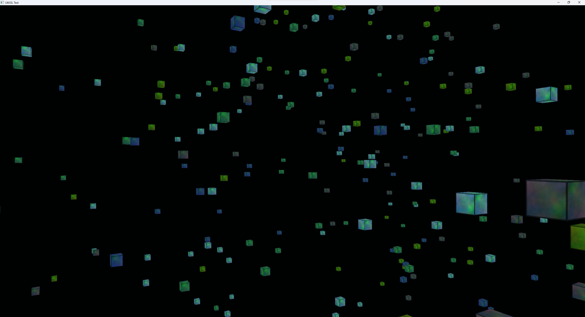

# ScreenSaver - OpenGL 3D Testing

This is just a little OpenGL testing project to get familiar with 3D before I move onto basic lighting

This code is mostly copied from my 2D snake game, however this time, texture loading is supported.

Nice rotating screensaver where cubes will randomly spawn

